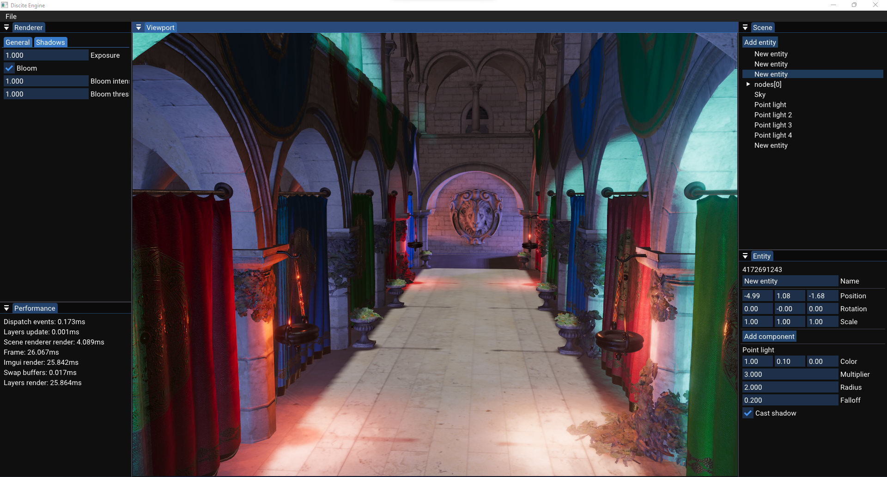
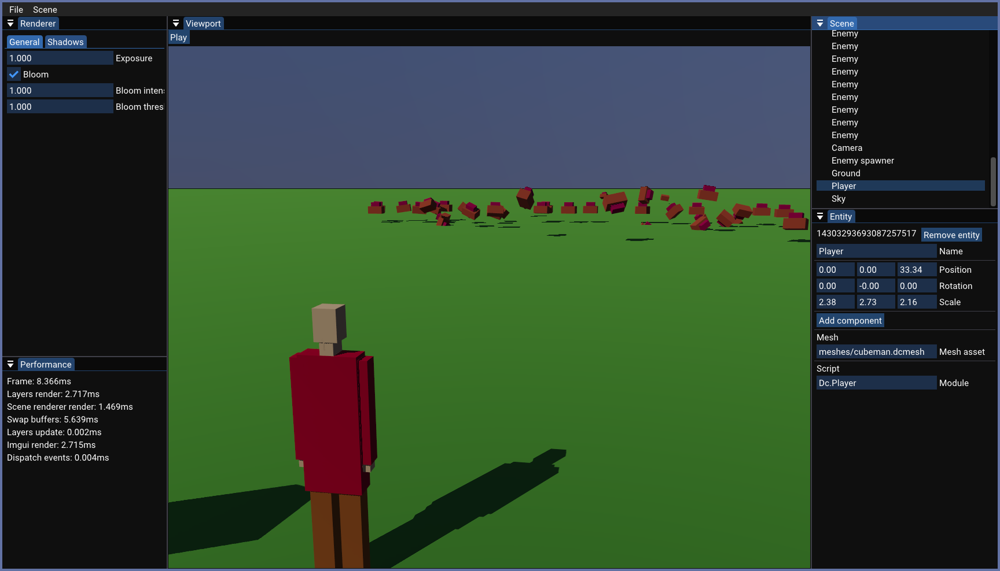

# Discite Engine

## Why? 🤔

Discite Engine is a real-time and interactive graphics application. It
allows users to create games. It's my goto project to learn, explore
and enjoy programming.

## Features 🚀

- Physical based rendering with [OpenGL](https://www.opengl.org)
- Bloom
- Soft shadows for directional and spot lights
- Entity-Component system 
- Scripting through [C#/Mono](https://www.mono-project.com/)
- Physic system through [NVIDIA PhysX](https://github.com/NVIDIAGameWorks/PhysX)
- Audio system
- WSIWYG Editor

## Screenshots 🖼





## Build 🏗

> **_NOTE:_** Currently it's only supported to build and run on Linux based systems.

You need to have a recent OpenGL driver (4.6), a modern **C++**
compiler, CMake, Ninja, Python3 and [Mono](https://www.mono-project.com/)
installed. On Arch-Linux it's as simple as typing `pacman -S mono
mono-msbuild python ninja cmake clang` on the command line to install it.

Then on a Linux system just clone the repository
```sh
git clone git@github.com:FlexW/discite.git
```
Then change into the directory
```sh
cd discite
```
and then configure the project with
```sh
cmake --preset clang_release # or cmake --preset gcc_release
```
And finally build the project
```sh
ninja -C build
```

## Run 🎮

It's required to specify a game/project directory on startup. To run
the editor with the simple example project enter
```sh
./bin/editor --data-directory /home/user/path/to/discite/game_data 
```
To run the game in the runtime enter
```sh
./bin/discite --data-directory /home/user/path/to/discite/game_data 
```
